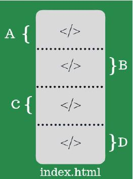
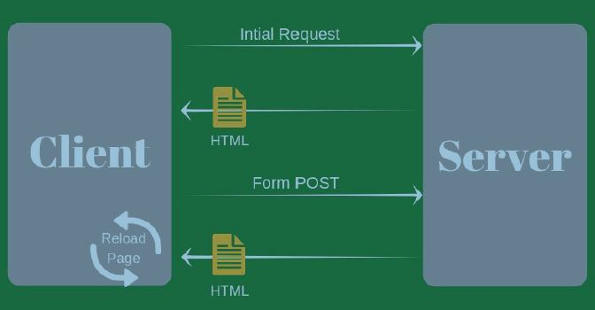
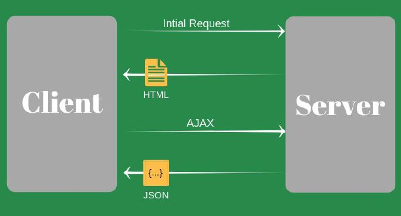
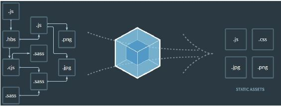
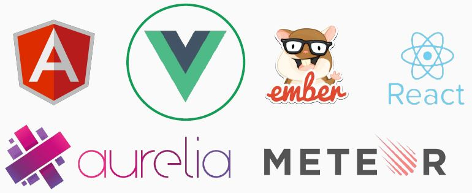
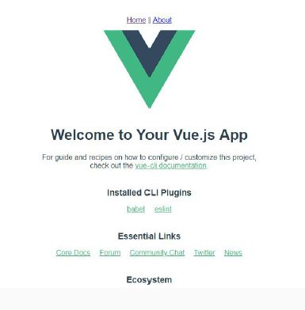

# O Framework Javascript Progressivo

Resumo do curso: O Framework Javascript Progressivo

Prof. Patrick Monteiro (@monteiropatrick)

## <a name="indice">Índice</a>

1. [Vue.js](#parte1)     
2. [Por que Vue?](#parte2)     
3. [Single Page Applications](#parte3)     
4. [Primeiros passos](#parte4)     
5. [Renderização Declarativa](#parte5)     
6. [Condicionais e Laços](#parte6)     
7. [Composição com Componentes](#parte7)     
8. [Ciclo de Vida da Instância](#parte8)     
9. [Dados Computados e Observadores](#parte9)     
10. [Interligações de Classe e Estilo](#parte10)     
11. [Modificadores de Teclado](#parte11)     
12. [Construindo um projeto.](#parte12)     
13. [Vuex](#parte13)     
14. [Teste e2e com Cypress](#parte14)     
---


## <a name="parte1">1 - Vue.js</a>

É um framework progressivo para a construção de interfaces de usuário. Ao contrário de outros frameworks monolíticos, Vue foi projetado desde sua concepção para ser adotável incrementalmente. A biblioteca principal é focada exclusivamente na camada visual (view layer), sendo fácil adotar e integrar com outras bibliotecas ou projetos existentes.

Por outro lado, Vue também é perfeitamente capaz de dar poder a sofisticadas Single-Page Applications quando usado em conjunto com ferramentas modernas e bibliotecas de apoio.

Fundador: Evan You (Desenvolvedor no projeto Meteor.)


[Voltar ao Índice](#indice)

---


## <a name="parte2">2 - Por que Vue?</a>

https://vimeo.com/247494684

[Voltar ao Índice](#indice)

---


## <a name="parte3">3 - Single Page Applications</a>

- É uma abordagem moderna de construção de aplicações Web;
- Aplicações inteiramente contidas no browser, que não necessitam fazer requisições de novas páginas para o servidor;
- Usam esse modelo: Gmail, Google Drive, Facebook, FourSquare e etc;

#### SPA NÃO LEVE AO PÉ DA LETRA!



#### SPA - Ciclo de vida de páginas tradicionais



#### SPA - Ciclo de vida de uma SPA



#### SPA - Características principais

#### Client-Side

- Todos os processos são executados no lado do cliente;
- A comunicação com o back-end é feita através de chamadas AJAX para end-points de uma API;
- Funciona independente do back-end, ou seja, o back-end pode ser em Java, Node, Php, Ruby, Python, Go, .Net;
- Facilita a migração de tecnologias;

#### LOAD

- Muitas vezes é feito apenas 1 vez na primeira requisição;
- Carregamento de assets como CSS, Javascript, Imagens;
- Em grandes aplicações é aconselhável aplicar a técnica de Lazy Loading;

#### ROUTER

- Peça importantíssima no desenvolvimento de SPA’s;
- É quem define/constrói tela para o usuário;
- Mesmo após um refresh permite que a página volte(ou quase) ao seu estado anterior;
- Não confundir com o router do back-end;
- Geralmente ele muda e analisa valores após o # na barra de endereços(com o HTML5, não se faz mais necessário o uso de #);

#### ARMAZENAMENTO
- Nas SPA’s é comum salvar dados localmente no browser do usuário;
- Geralmente é armazenado um token e outras informações básicas;
- É incomum usar cookies para essas tarefas;

#### ESTRATÉGIAS IMPORTANTES

- Otimização do conteúdo e redução de requisições;
- Minificação e ofuscação(CSS, Javascript)
- Uso de algum empacotador(bundle) como Webpack;



#### ATENÇÃO REDOBRADA
- Histórico de navegação(Back and Forward);
- Search Engine Optimization(SEO);
- Estatísticas do site;
- Sobrecarga do cliente;

#### SPA - Frameworks



#### SPA - Vantagens no uso de Frameworks

- Eficiência
  - Projetos que costumavam levar meses e centenas de linhas de código, agora podem ser alcançados muito mais rápido com padrões e funções bem estruturadas;
- Segurança
  - As principais estruturas de javascript tem acordos de seguranças firmes e são suportadas por grandes comunidades;
- Custo
  - Grande parte dos frameworks do mercado são de código aberto, ou seja, não geram custos para uma empresa ou desenvolvedor utiliza-lo;
- Feedback
  - Por ser mantido por uma grande comunidade, dúvidas são respondidas rapidamente nos fóruns;
- CLI
  - Agilizam o workflow

[Voltar ao Índice](#indice)

---

## <a name="parte4">4 - Primeiros passos</a>

O primeiro passo para começar a desenvolver aplicações com Vue.js é acessar a documentação e ler.

Conselho: Se você é totalmente novo no mundo web, o Vue não é a melhor alternativa para se começar. Para utilizá-lo é necessário um conhecimento intermediário em HTML, CSS e principalmente Javascript.

Documentação oficial Vue: https://br.vuejs.org
Documentação Vue-Cli 3x: https://cli.vuejs.org
Documentação Vue-Cli 2x: https://github.com/vuejs/vue-cli/tree/v2#vue-cli--

#### Pré-requisitos

O Vue CLI requer o Node.js versão 8.9 ou superior (8.11.0+ recomendado).

#### Instalando o Vue-Cli 3x

No cmd, basta digitar o comando e pressionar Enter:

```
$ npm install @vue/cli

$ vue -V
@vue/cli 4.2.3

```

Criando projeto com Vue-cli:

```
$ vue create hello-world
```

#### Rodando o projeto

Após criar o projeto com o Vue-cli, basta acessar a pasta:

```
cd nome-projeto

```
Depois iniciar o projeto com o comando:

```
npm run serve
```

#### Ativando o HRM (Hot Module Reload)

Como o webpack agora vem externo da aplicação, é necessário criar um arquivo vue.config.js na raiz do projeto e configurar a funcionalidade de watch nos arquivos do projeto.

- https://webpack.js.org/configuration/dev-server/#devserver-watchoptions-

* O Webpack é um bundler de módulo JavaScript de código aberto. Seu principal objetivo é agregar arquivos JavaScript para uso em um navegador, mas também é capaz de transformar, empacotar ou empacotar qualquer recurso ou ativo.

#### Tela Inicial do projeto




[Voltar ao Índice](#indice)

---


## <a name="parte5">5 - Renderização Declarativa</a>


[Voltar ao Índice](#indice)

---


## <a name="parte6">6 - Condicionais e Laços</a>


[Voltar ao Índice](#indice)

---


## <a name="parte7">7 - Composição com Componentes</a>


[Voltar ao Índice](#indice)

---


## <a name="parte8">8 - Ciclo de Vida da Instância</a>


[Voltar ao Índice](#indice)

---


## <a name="parte9">9 - Dados Computados e Observadores</a>


[Voltar ao Índice](#indice)

---


## <a name="parte10">10 - Interligações de Classe e Estilo</a>


[Voltar ao Índice](#indice)

---


## <a name="parte11">11 - Modificadores de Teclado</a>


[Voltar ao Índice](#indice)

---


## <a name="parte12">12 - Construindo um projeto.</a>


[Voltar ao Índice](#indice)

---


## <a name="parte13">13 - Vuex</a>


[Voltar ao Índice](#indice)

---


## <a name="parte14">14 - Teste e2e com Cypress</a>


[Voltar ao Índice](#indice)

---

